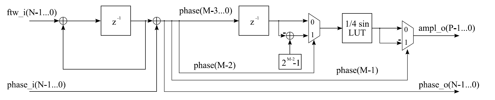
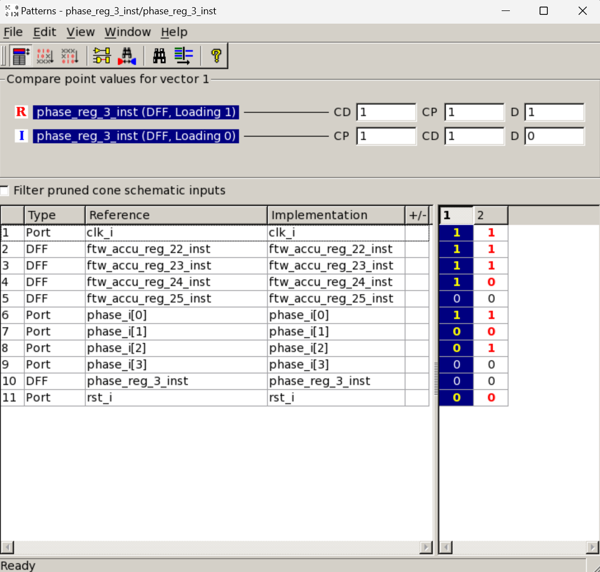
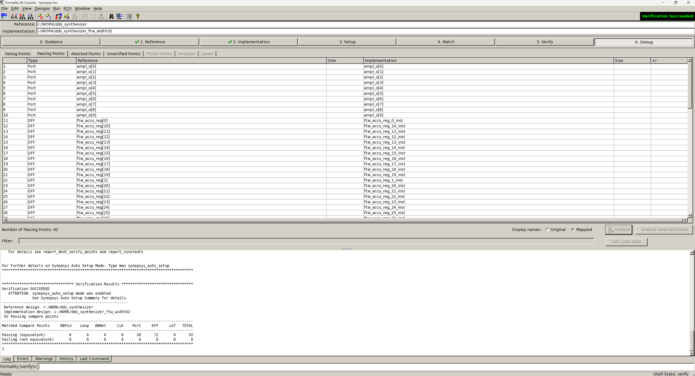
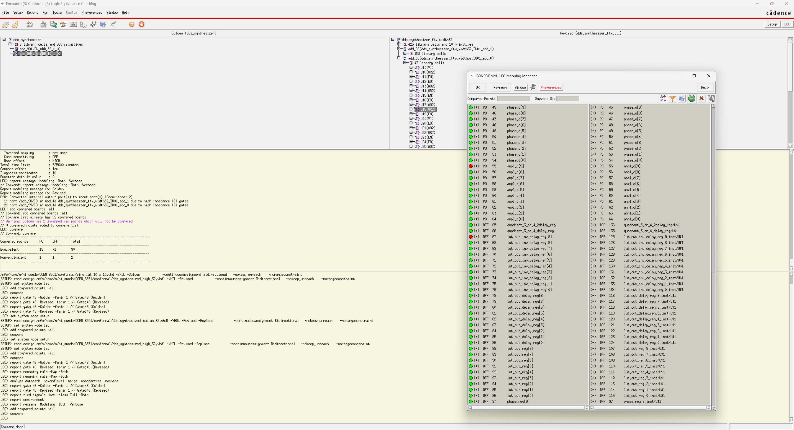
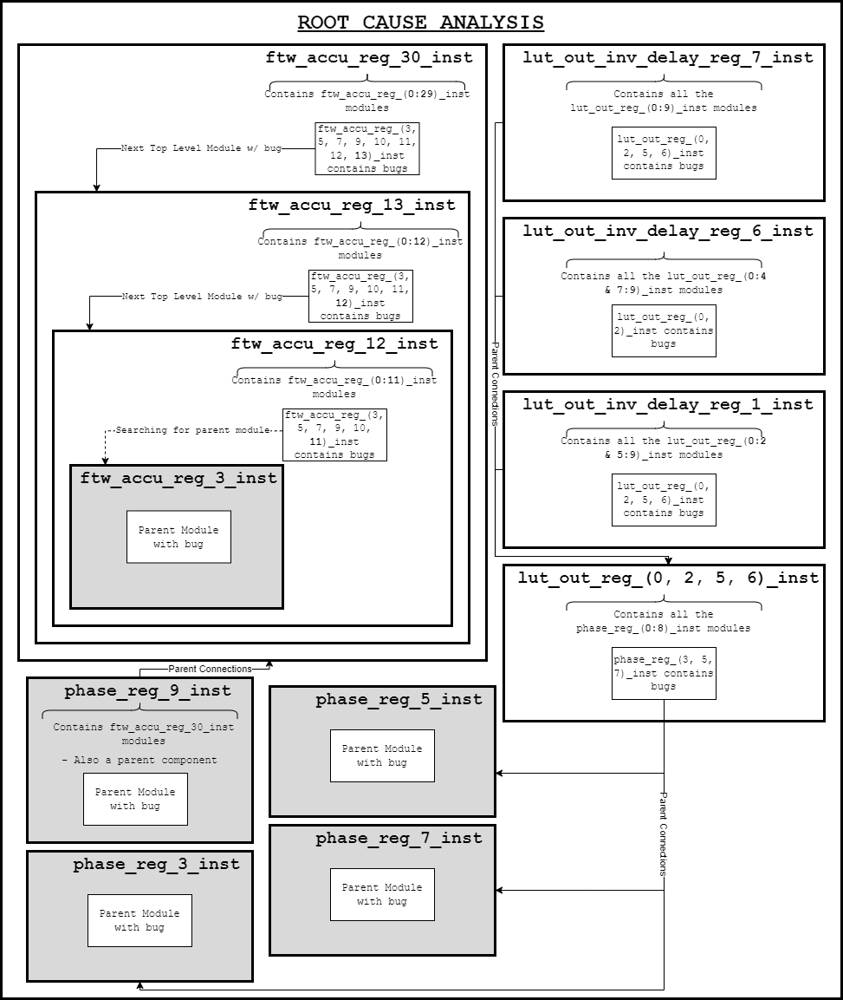
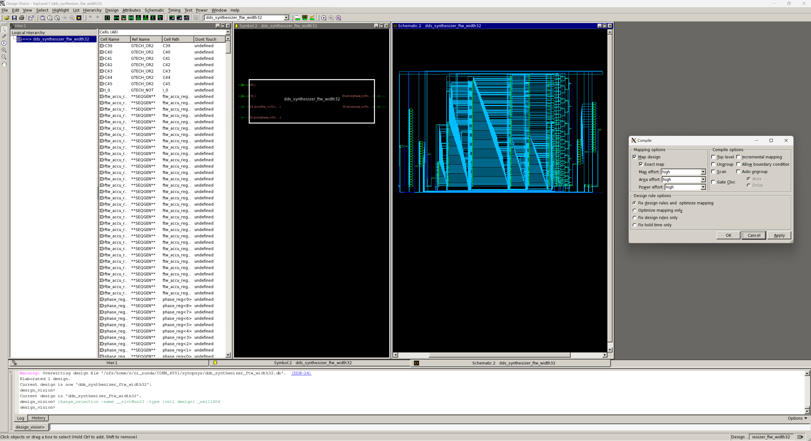
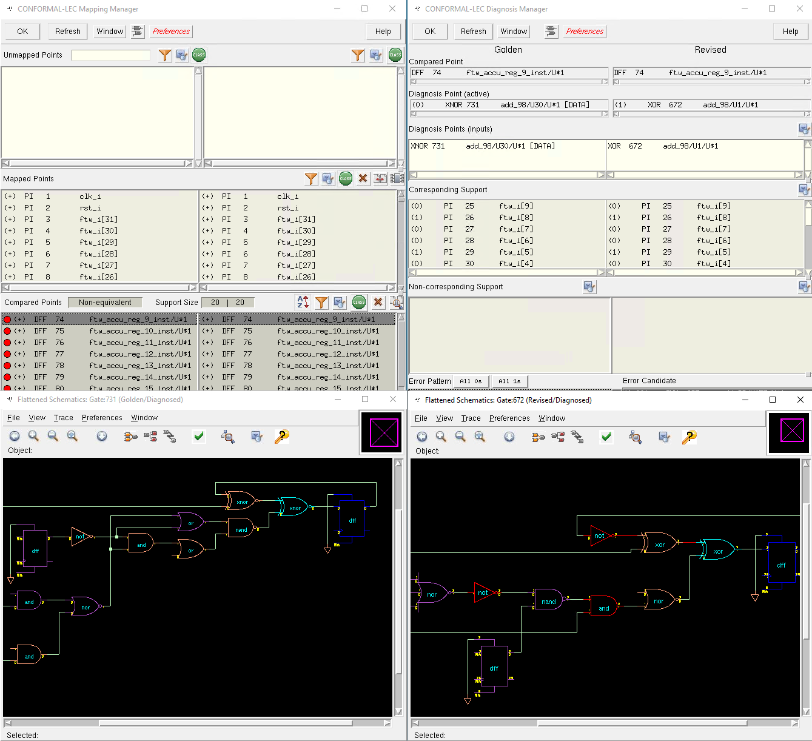

# Formal Verification of a DDS Synthesizer

## Overview
This repository documents the formal verification process for a **Direct Digital Synthesizer (DDS)** module. The project employs **Synopsys Formality** and **Cadence Conformal** to validate the synthesized gate-level model against its RTL equivalent, ensuring functional correctness.

  

## Table of Contents
1. [Introduction](#introduction)
2. [System Behavior and Function](#system-behavior-and-function)
   - Frequency Synthesis
   - Phase and Amplitude Modulation
   - Lookup Tables (LUTs)
   - System Architecture
3. [RTL Synthesis](#rtl-synthesis)
4. [Equivalence Checking](#equivalence-checking)
   - Using Synopsys Formality
   - Using Cadence Conformal
5. [Verification Process](#verification-process)
   - Verification Methodology
   - Tool Comparisons
6. [Results and Analysis](#results-and-analysis)
7. [Conclusion](#conclusion)

---

## Introduction
The purpose of this project is to verify the accuracy and functionality of a **Direct Digital Synthesizer (DDS)** using **formal verification techniques**. The DDS is widely used in signal processing and communication systems, necessitating high reliability. To ensure correctness, the design is analyzed using **Synopsys Formality** and **Cadence Conformal**.

## System Behavior and Function
The DDS module, also known as a **Numerically-Controlled Oscillator (NCO)**, generates sine waves with precise frequency and phase characteristics.

### Frequency Synthesis
The output sine wave frequency is determined by the **Frequency Tuning Word (FTW)**:

\[ f_{DDS} = \frac{FTW}{2^M} \times f_s \]

Where:
- \( f_{DDS} \) is the output frequency
- \( FTW \) is the frequency tuning word
- \( M \) is the resolution of the FTW

### Phase and Amplitude Modulation
Phase and amplitude modulation parameters enable precise signal adjustments:

\[ \phi_{DDS} = \frac{PTW}{2^N} \times 2\pi \]

Where:
- \( PTW \) is the phase tuning word
- \( N \) is the resolution of the PTW

### Lookup Tables (LUTs)
Precomputed sine values are stored in LUTs to optimize performance.

 

### System Architecture
The DDS block diagram outlines its key components, excluding clock and reset signals for clarity.

## RTL Synthesis
The design is synthesized from **Register Transfer Level (RTL) to Gate-level** using **Synopsys Design Compiler**. The synthesized model serves as a reference for equivalence checking.

## Equivalence Checking
This step ensures that the synthesized model remains functionally equivalent to the RTL design.

### Using Synopsys Formality
The **Formality tool** compares RTL and Gate-level descriptions, ensuring consistency.

  

### Using Cadence Conformal
The **Conformal tool** is used to cross-validate results, often detecting additional mismatches.

  

## Verification Process
A structured methodology is used to analyze the verification process.

### Verification Methodology
A logical approach is followed to trace and validate design inconsistencies.

    

### Tool Comparisons
Both **Synopsys Formality** and **Cadence Conformal** are used to enhance verification confidence.

  
  

## Results and Analysis
Verification results confirm design correctness through cross-tool validation.

## Conclusion
The verification process has successfully demonstrated the correctness of the DDS module through formal methods. By utilizing **Synopsys Formality** and **Cadence Conformal**, we ensured that the design is robust and meets functional requirements. The structured verification approach enhanced accuracy and confidence in the results, highlighting the effectiveness of formal verification in hardware validation. Future efforts may explore additional verification techniques and automation to further improve efficiency and coverage.

